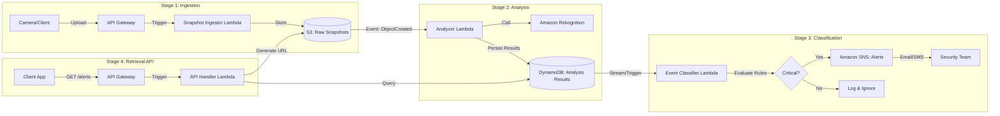

# SnapSentinel

**Serverless Security Snapshot Analysis Pipeline**

SnapSentinel is a robust, serverless data pipeline designed to ingest, analyze, and classify security camera screenshots in real-time. By leveraging the power of AWS cloud-native services, it automates the detection of critical events—such as the presence of weapons or unauthorized persons—transforming raw image data into actionable security alerts.

## 🚀 Project Overview

In modern security infrastructure, manual monitoring of camera feeds is inefficient and prone to human error. SnapSentinel solves this by providing an automated, scalable backend that:
1.  **Ingests** high-volume image streams.
2.  **Analyzes** content using machine learning (Amazon Rekognition).
3.  **Classifies** events based on configurable business rules.
4.  **Alerts** stakeholders immediately when threats are detected.

Built entirely on AWS serverless architecture, SnapSentinel scales to zero when idle and handles burst traffic effortlessly, making it a cost-effective solution for smart surveillance.

---

## 🏗️ Architecture

SnapSentinel employs an event-driven architecture orchestrated by AWS Lambda and Amazon S3. The pipeline is divided into three distinct stages:



### Pipeline Stages

1.  **Ingestion**:
    *   Images are uploaded via API Gateway.
    *   **Snapshot Ingestor** validates and saves the image to an S3 bucket (`raw-snapshots`).
2.  **Analysis**:
    *   S3 events trigger the **Analyzer** function.
    *   **Amazon Rekognition** detects labels (e.g., "Person", "Gun", "Car").
    *   Results are stored in **Amazon DynamoDB** with confidence scores.
3.  **Classification**:
    *   New DynamoDB records trigger the **Event Classifier**.
    *   Business rules are applied (e.g., *IF Label='Gun' AND Confidence > 90%*).
    *   **Amazon SNS** publishes alerts to subscribed endpoints (Email/SMS) for critical findings.
4.  **Retrieval API**:
    *   REST API to fetch alerts and analysis results.
    *   Generates **Presigned URLs** for secure, temporary access to the raw images in S3.

---

## 📂 Repository Structure

The project follows a modular structure, separating infrastructure code from application logic.

```text
.
├── .github/
│   └── workflows/            # CI/CD pipelines (ci.yml, cd.yml)
├── lambdas/                  # Source code for Lambda functions
│   ├── snapshot_ingestor/    # Stage 1: Handles image upload to S3
│   ├── analyzer/             # Stage 2: Rekognition integration
│   ├── event_classifier/     # Stage 3: Business logic & alerting
│   └── api_handler/          # Stage 4: API for retrieving alerts
├── terraform/                # Infrastructure as Code (IaC)
│   └── stages/
│       ├── 1_ingest/         # API Gateway, S3, Ingestor Lambda
│       ├── 2_analysis/       # Analyzer Lambda, DynamoDB, IAM roles
│       ├── 3_classification/ # Classifier Lambda, SNS Topic
│       └── 4_api/            # API Gateway, Handler Lambda
├── tests/                    # End-to-end and integration tests
│   ├── unit/                 # Local unit tests
│   ├── integration/          # Tests against AWS dev environment
│   └── e2e/                  # Full pipeline tests
└── Makefile                  # Automation for build, deploy, and test
```

---

## 🛠️ Deployment

SnapSentinel uses **Terraform** for infrastructure provisioning and a **Makefile** to streamline the developer workflow.

### Prerequisites
*   **AWS CLI** (configured with appropriate credentials)
*   **Terraform** (v1.0+)
*   **Python 3.9+**
*   **Make**

### Setup
1.  Clone the repository:
    ```bash
    git clone https://github.com/your-username/SnapSentinel.git
    cd SnapSentinel
    ```
2.  Initialize Terraform variables (create `terraform.dev.tfvars` in stage folders if needed, or use defaults).

### Deploying Stages
You can deploy stages individually to test specific parts of the pipeline.

**Stage 1: Ingestion**
```bash
make tf-apply-1_ingest
```

**Stage 2: Analysis**
```bash
make tf-apply-2_analysis
```

**Stage 3: Classification**
```bash
make tf-apply-3_classification
```

**Stage 4: API**
```bash
make tf-apply-4_api
```

> **Note**: Ensure previous stages are deployed before advancing, as later stages depend on resources (like S3 buckets or DynamoDB tables) created earlier.

---

## 🕹️ Usage & Testing

The project includes a comprehensive testing suite documented in `test_guide.md`.

### 1. Unit Tests (Local)
Tests Lambda logic in isolation using `moto`.
```bash
make test-unit
```

### 2. Integration Tests (AWS Dev)
Verifies each stage against the deployed development environment.
```bash
make test-integration
```

### 3. End-to-End Tests
Uploads an image and verifies the full pipeline latency and alerting.
```bash
make test-e2e
```

### Utility Commands
*   **Build Lambdas**: `make build-lambda-analyzer` (or others)
*   **Destroy Infrastructure**: `make tf-destroy-all` (Safely tears down all resources in reverse order)

---

## 🔄 CI/CD Pipelines

Automated pipelines via GitHub Actions:

*   **CI (`ci.yml`)**: Runs on Pull Requests. Executes linting and unit tests.
*   **CD (`cd.yml`)**: Runs on push to `main`. Deploys infrastructure to `dev`, runs integration tests, and promotes to `prod` (manual approval).

---

## 📊 Observability

*   **Logs**: All Lambda functions output structured JSON logs to **Amazon CloudWatch Logs** for easy querying and debugging.
*   **Metrics**: Standard Lambda metrics (Invocation, Error, Duration) are available in CloudWatch.
*   **Tracing**: (Roadmap) AWS X-Ray integration for distributed tracing.

---

## 🗺️ Roadmap

- [ ] **AWS X-Ray**: Implement end-to-end tracing for latency optimization.
- [ ] **Dashboards**: Create a CloudWatch Dashboard for "Alerts per Hour" and "Average Processing Time".
- [ ] **CI/CD**: specific GitHub Actions pipeline for automated testing and deployment.
- [ ] **Advanced Rules**: Move hardcoded business rules to a dynamic configuration (e.g., AWS AppConfig).
- [ ] **Frontend**: A simple React dashboard to view recent alerts and images.

---
