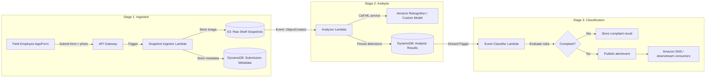

# Shelf-Compliance-Vision-MVP

Shelf-Compliance-Vision-MVP is an MVP for retail shelf intelligence.
It processes in-store shelf photos to verify product placement, check compliance with commercial agreements, and support analysis of how shelf position can influence sales.

This solution was built to validate a practical workflow:
store employee submits a short form + shelf photo, then a serverless pipeline processes the image and stores structured outputs for reporting and decision-making.

**Serverless Shelf Intelligence Pipeline**

Shelf-Compliance-Vision-MVP is an event-driven, serverless data pipeline on AWS designed to ingest, analyze, and classify supermarket shelf snapshots in near real-time.

## 🚀 Project Overview

In field execution, manual shelf audits are slow and inconsistent. This project provides an automated backend that:
1. **Ingests** shelf photos and metadata from field teams.
2. **Analyzes** image content with ML services.
3. **Classifies** compliance against configurable shelf/planogram rules.
4. **Publishes** structured results for analytics and operational follow-up.

Built on AWS serverless architecture, the system scales with demand and keeps operations cost-efficient.

---

## Demo


## 🏗️ Architecture

The pipeline is split into three stages:


```mermaid
flowchart LR
    subgraph Stage 1: Ingestion
    A[Field Employee App/Form] -->|Submit form + photo| B[API Gateway]
    B -->|Trigger| C[Snapshot Ingestor Lambda]
    C -->|Store image| D[(S3: Raw Shelf Snapshots)]
    C -->|Store metadata| E[(DynamoDB: Submission Metadata)]
    end

    subgraph Stage 2: Analysis
    D -->|Event: ObjectCreated| F[Analyzer Lambda]
    F -->|Call ML service| G[Amazon Rekognition / Custom Model]
    F -->|Persist detections| H[(DynamoDB: Analysis Results)]
    end

    subgraph Stage 3: Classification
    H -->|Stream/Trigger| I[Event Classifier Lambda]
    I -->|Evaluate rules| J{Compliant?}
    J -->|Yes| K[Store compliant result]
    J -->|No| L[Publish alert/event]
    L --> M[Amazon SNS / downstream consumers]
    end
```

### Pipeline Stages

1. **Ingestion**
   - Employees submit a shelf image and form data.
   - `snapshot_ingestor` validates payload and stores raw image in S3.
2. **Analysis**
   - S3 events trigger `analyzer`.
   - ML inference identifies products and shelf placement signals.
   - Results are stored in DynamoDB.
3. **Classification**
   - New analysis records trigger `event_classifier`.
   - Business rules evaluate compliance and merchandising conditions.
   - Outputs feed alerts and analytics-ready datasets.

---

## 📂 Repository Structure

```text
.
├── lambdas/                  # Lambda source code
│   ├── snapshot_ingestor/    # Stage 1: ingestion and validation
│   ├── analyzer/             # Stage 2: ML inference and extraction
│   └── event_classifier/     # Stage 3: business-rule evaluation
├── terraform/                # Infrastructure as Code
│   └── stages/
│       ├── 1_ingest/         # API Gateway, S3, ingest Lambda
│       ├── 2_analysis/       # analyzer Lambda, data storage, IAM
│       └── 3_classification/ # classifier Lambda, event/alert resources
├── tests/                    # End-to-end and integration tests
│   ├── step1/                # ingestion verification
│   ├── step2/                # analysis verification
│   └── step3/                # classification verification
└── Makefile                  # build, deploy, test, destroy automation
```

---

## 🛠️ Deployment

Uses **Terraform** for provisioning and a **Makefile** for local workflow.

### Prerequisites
- **AWS CLI** configured with valid credentials
- **Terraform** v1.0+
- **Python** 3.9+
- **Make**

### Setup

```bash
git clone https://github.com/gustipardo/Shelf-Compliance-Vision-MVP.git
cd Shelf-Compliance-Vision-MVP
```

Create `terraform.dev.tfvars` in stage folders if you need custom variables, or use defaults.

### Deploy by Stage

```bash
make tf-apply-1_ingest
make tf-apply-2_analysis
make tf-apply-3_classification
```

Deploy in order because later stages depend on resources from earlier ones.

---

## 🕹️ Usage & Testing

```bash
make test-ingest
make test-analysis
make test-classification
```

### Utility Commands
- Build lambdas: `make build-lambda-analyzer` (and related targets)
- Destroy all: `make tf-destroy-all`

---

## 📊 Observability

- **Logs:** structured logs in Amazon CloudWatch Logs
- **Metrics:** Lambda invocation/error/duration metrics in CloudWatch
- **Tracing (roadmap):** AWS X-Ray integration

---

## 🗺️ Roadmap

- [ ] Add confidence-calibrated product matching for similar packaging
- [ ] Add planogram versioning and dynamic rule configuration (e.g., AppConfig)
- [ ] Add dashboard for compliance rate by store/brand/SKU
- [ ] Add CI/CD pipeline for automated test + deploy
- [ ] Add feedback loop for model improvement from manual review outcomes

---

## Note on Naming

This project was previously documented as `SnapSentinel` during early MVP framing.
The current name, `Shelf-Compliance-Vision-MVP`, reflects the retail shelf compliance and merchandising analytics use case.
****
