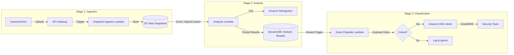

# SnapSentinel

SnapSentinel was developed as part of an MVP for an AI-powered autonomous security platform.
The goal was to validate whether real-time image analysis could reliably detect intrusions,
weapons, and suspicious activity using existing security cameras.

This MVP successfully validated the concept and was later evolved into a production system
now deployed across commercial, industrial, and retail sites worldwide.

**Serverless Security Snapshot Analysis Pipeline**

SnapSentinel is a robust, serverless data pipeline designed to ingest, analyze, and classify security camera screenshots in real-time. By leveraging the power of AWS cloud-native services, it automates the detection of critical events—such as the presence of weapons or unauthorized persons—transforming raw image data into actionable security alerts.

## 🚀 Project Overview

In modern security infrastructure, manual monitoring of camera feeds is inefficient and prone to human error. SnapSentinel solves this by providing an automated, scalable backend that:
1.  **Ingests** high-volume image streams.
2.  **Analyzes** content using machine learning (Amazon Rekognition).
3.  **Classifies** events based on configurable business rules.
4.  **Alerts** stakeholders immediately when threats are detected.

Built entirely on AWS serverless architecture, SnapSentinel scales to zero when idle and handles burst traffic effortlessly, making it a cost-effective solution for smart surveillance.

---

## Demo


## 🏗️ Architecture

SnapSentinel employs an event-driven architecture orchestrated by AWS Lambda and Amazon S3. The pipeline is divided into three distinct stages:



### Pipeline Stages

1.  **Ingestion**:
    *   Images are uploaded via API Gateway.
    *   **Snapshot Ingestor** validates and saves the image to an S3 bucket (`raw-snapshots`).
2.  **Analysis**:
    *   S3 events trigger the **Analyzer** function.
    *   **Amazon Rekognition** detects labels (e.g., "Person", "Gun", "Car").
    *   Results are stored in **Amazon DynamoDB** with confidence scores.
3.  **Classification**:
    *   New DynamoDB records trigger the **Event Classifier**.
    *   Business rules are applied (e.g., *IF Label='Gun' AND Confidence > 90%*).
    *   **Amazon SNS** publishes alerts to subscribed endpoints (Email/SMS) for critical findings.

---

## 📂 Repository Structure

The project follows a modular structure, separating infrastructure code from application logic.

```text
.
├── lambdas/                  # Source code for Lambda functions
│   ├── snapshot_ingestor/    # Stage 1: Handles image upload to S3
│   ├── analyzer/             # Stage 2: Rekognition integration
│   └── event_classifier/     # Stage 3: Business logic & alerting
├── terraform/                # Infrastructure as Code (IaC)
│   └── stages/
│       ├── 1_ingest/         # API Gateway, S3, Ingestor Lambda
│       ├── 2_analysis/       # Analyzer Lambda, DynamoDB, IAM roles
│       └── 3_classification/ # Classifier Lambda, SNS Topic
├── tests/                    # End-to-end and integration tests
│   ├── step1/                # Ingestion verification
│   ├── step2/                # Analysis & DB verification
│   └── step3/                # Alerting verification
└── Makefile                  # Automation for build, deploy, and test
```

---

## 🛠️ Deployment

SnapSentinel uses **Terraform** for infrastructure provisioning and a **Makefile** to streamline the developer workflow.

### Prerequisites
*   **AWS CLI** (configured with appropriate credentials)
*   **Terraform** (v1.0+)
*   **Python 3.9+**
*   **Make**

### Setup
1.  Clone the repository:
    ```bash
    git clone https://github.com/your-username/SnapSentinel.git
    cd SnapSentinel
    ```
2.  Initialize Terraform variables (create `terraform.dev.tfvars` in stage folders if needed, or use defaults).

### Deploying Stages
You can deploy stages individually to test specific parts of the pipeline.

**Stage 1: Ingestion**
```bash
make tf-apply-1_ingest
```

**Stage 2: Analysis**
```bash
make tf-apply-2_analysis
```

**Stage 3: Classification**
```bash
make tf-apply-3_classification
```

> **Note**: Ensure previous stages are deployed before advancing, as later stages depend on resources (like S3 buckets or DynamoDB tables) created earlier.

---

## 🕹️ Usage & Testing

The project includes a comprehensive `Makefile` to run automated tests for each stage.

### 1. Test Ingestion
Simulates a camera upload. Checks if the image lands in S3.
```bash
make test-ingest
```

### 2. Test Analysis
Uploads a sample image and queries DynamoDB to verify Rekognition labels are saved.
```bash
make test-analysis
```

### 3. Test Classification
Triggers the full pipeline and verifies that critical events result in an SNS alert (check your subscribed email).
```bash
make test-classification
```

### Utility Commands
*   **Build Lambdas**: `make build-lambda-analyzer` (or others)
*   **Destroy Infrastructure**: `make tf-destroy-all` (Safely tears down all resources in reverse order)

---

## 📊 Observability

*   **Logs**: All Lambda functions output structured JSON logs to **Amazon CloudWatch Logs** for easy querying and debugging.
*   **Metrics**: Standard Lambda metrics (Invocation, Error, Duration) are available in CloudWatch.
*   **Tracing**: (Roadmap) AWS X-Ray integration for distributed tracing.

---

## 🗺️ Roadmap

- [ ] **AWS X-Ray**: Implement end-to-end tracing for latency optimization.
- [ ] **Dashboards**: Create a CloudWatch Dashboard for "Alerts per Hour" and "Average Processing Time".
- [ ] **CI/CD**: specific GitHub Actions pipeline for automated testing and deployment.
- [ ] **Advanced Rules**: Move hardcoded business rules to a dynamic configuration (e.g., AWS AppConfig).
- [ ] **Frontend**: A simple React dashboard to view recent alerts and images.

---
